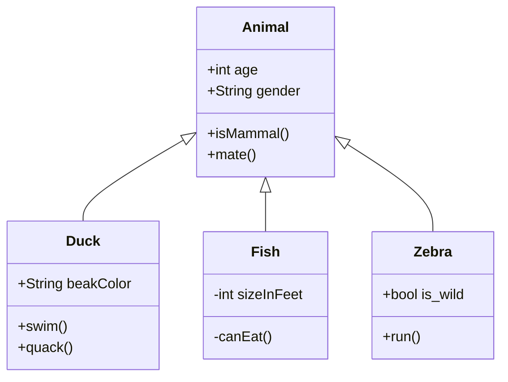

When \(a \ne 0\), there are two solutions to \(ax^2 + bx + c = 0\) and they are
$$x = {-b \pm \sqrt{b^2-4ac} \over 2a}.$$

$$
\overbrace{1+2+\cdots+n}^{n个} \qquad \underbrace{a+b+\cdots+z}_{26}
$$
	
$$\begin{bmatrix}
1 & 2 & \cdots \\
67 & 95 & \cdots \\
\vdots  & \vdots & \ddots \\
\end{bmatrix}
\tag*{3.2.1}$$

$$D(x) = \begin{cases}
\lim\limits_{x \to 0} \frac{a^x}{b+c}, & x<3 \\
\pi, & x=3 \\
\int_a^{3b}x_{ij}+e^2 \mathrm{d}x,& x>3 \\
\end{cases}
\tag{1}
$$
	




```xml
<html lang="{{ __return }}">
  <head>
    <script>

    </script>

  </head>
  <body>
    <div class="root" data-is-touch="false">
    </div>
    <script>
    </script>
  </body>
</html>
```


`success`{:.success}

Success Text. {:.success}


